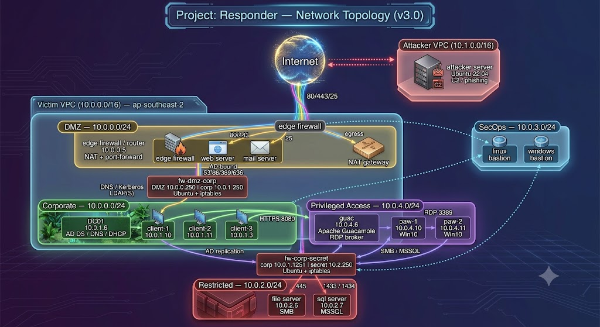

```yml

██████╗ ██████╗  █████╗      ██╗███████╗ █████╗ ████████╗██╗
██╔══██╗██╔══██╗██╔══██╗     ██║██╔════╝██╔══██╗╚══██╔══╝╚═╝
██████╔╝██████╔╝██║  ██║     ██║█████╗  ██║  ╚═╝   ██║      
██╔═══╝ ██╔══██╗██║  ██║██╗  ██║██╔══╝  ██║  ██╗   ██║      
██║     ██║  ██║╚█████╔╝╚█████╔╝███████╗╚█████╔╝   ██║   ██╗
╚═╝     ╚═╝  ╚═╝ ╚════╝  ╚════╝ ╚══════╝ ╚════╝    ╚═╝   ╚═╝

██████╗ ███████╗ ██████╗██████╗  █████╗ ███╗  ██╗██████╗ ███████╗██████╗ 
██╔══██╗██╔════╝██╔════╝██╔══██╗██╔══██╗████╗ ██║██╔══██╗██╔════╝██╔══██╗
██████╔╝█████╗  ╚█████╗ ██████╔╝██║  ██║██╔██╗██║██║  ██║█████╗  ██████╔╝
██╔══██╗██╔══╝   ╚═══██╗██╔═══╝ ██║  ██║██║╚████║██║  ██║██╔══╝  ██╔══██╗
██║  ██║███████╗██████╔╝██║     ╚█████╔╝██║ ╚███║██████╔╝███████╗██║  ██║
╚═╝  ╚═╝╚══════╝╚═════╝ ╚═╝      ╚════╝ ╚═╝  ╚══╝╚═════╝ ╚══════╝╚═╝  ╚═╝

```


# Overview
`Project: Responder` is an initiative of CSIRT to up-skill Incident Responders to be pseudo Windows SMEs. This repository contains all the code required to build and configure an environment for the training. It is designed to mimic that of a small corporate network with typical workloads and network segmentation.

### `Project: Responder` Infrastructure Diagram


# Building `Project: Responder` 
Specific instructions are provided in both the terraform/ and ansible/ directories of this repository, however a Makefile has also been provided for ease of use. Using the make file, the entire build process can be called in one command, for example `make build-apac`.

Copy `.env.example` to `.env` and fill in your AWS account ID, KMS key ID, S3 backend bucket, AWS profile, and trusted source CIDRs — `make` reads `.env` automatically. You'll need an admin role on the target AWS account; terraform assumes the account to deploy to is the account where the credentials are valid.

At a high level:

1. Download the certs for responder from 1pass, and put them in ./terraform/certs
2. Run the command `chmod 600 ./terraform/certs/*`
3. cd into terraform and run `terraform init`
4. Download the latest crowdstrike sensor installer from crowdstrike, rename it to `WindowsSensor.exe` and put it in `./ansible/windows/files/`

Attack scripts support **multiple C2 backends** (`metasploit`, `Sliver`, `Mythic`, `Havoc`) via `C2_FRAMEWORK`; see `scripts/attack_c2_helpers/README.txt`. Optional: `./scripts/attack_server_install_all_c2_tools.sh <region>` pre-installs tooling on the attack server.

The Makefile contains the following targets which can be called by `make <target>`
- **build-<apac|emea|amer|star|test-env>**: Builds the entire environment using terraform and ansible 
- **destroy-<apac|emea|amer|star|test-env>**: Destroys the entire environment using terraform
- **re-build-<apac|emea|amer|star|test-env>**: Re-builds the windows-based infrastructure in the environment. Useful for refreshing the environment without destroying everything
- **env-usage-report**: Displays current state of each onboarded environment
- **destroy-all**: Destroys all environments. USE WITH CAUTION!

